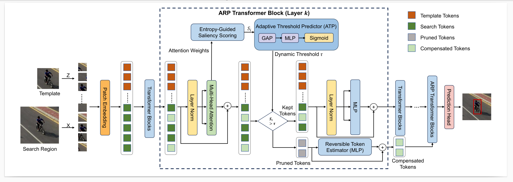

# EnTeR-Track

The official implementation for the paper:

**EnTeR-Track: Efficient UAV Tracking via Entropy-Guided Pruning and Reversible Token Recovery**

EnTeR-Track is an efficient UAV visual tracking framework designed for real-time deployment on resource-constrained platforms. It introduces an entropy-guided adaptive reversible pruning mechanism to reduce redundant search tokens while preserving tracking robustness.


<p align="center">
  
</p>

## News

**[Coming Soon]**
- Code, pretrained models, and raw tracking results will be released.

## Highlights

### :star2: Entropy-Guided Early Token Pruning

EnTeR-Track uses attention entropy as an uncertainty-aware saliency measure for early-layer token selection. Instead of relying only on raw attention magnitude, the proposed entropy-guided scoring evaluates the concentration degree of attention distributions, making token pruning more reliable in shallow Transformer layers.

This design is especially suitable for UAV tracking, where targets are often small and backgrounds may contain clutter, motion blur, or distractors.

### :star2: Reversible Token Compensation

Most existing token pruning methods permanently discard tokens once they are removed. This may cause irreversible spatial information loss and degrade localization accuracy.

To address this issue, EnTeR-Track introduces a lightweight Reversible Token Estimator. Pruned tokens bypass expensive self-attention computation and are compensated by a residual estimator, which helps preserve structural context for final localization.

### :star2: Adaptive Computation for UAV Tracking

EnTeR-Track adopts an Adaptive Threshold Predictor (ATP) to dynamically adjust the pruning threshold according to scene complexity. This allows the tracker to allocate more computation to challenging scenes and prune more aggressively in simple backgrounds.

### :star2: Strong Accuracy-Speed Trade-off

On UAV benchmarks, EnTeR-Track achieves strong tracking performance while improving inference efficiency.

| Tracker | DTB70 Succ. | UAVDT Succ. | UAV123 Succ. | UAV123@10fps Succ. | UAVTrack112 Succ. | GPU FPS | CPU FPS |
|:-------:|:-----------:|:-----------:|:------------:|:------------------:|:-----------------:|:-------:|:-------:|
| OSTrack-T | 64.4 | 60.0 | 66.8 | 66.1 | 67.5 | 240.9 | 98.4 |
| EnTeR-Track-T | 64.5 | 61.1 | 67.5 | 65.9 | 67.3 | 256.8 | 119.1 |

EnTeR-Track-T achieves **67.5% AUC on UAV123**, while running at **256.8 FPS on GPU** and **119.1 FPS on CPU**.

## Method Overview

EnTeR-Track is built upon a one-stream Vision Transformer tracking framework and introduces an Adaptive Reversible Pruning mechanism.

The proposed framework contains three main components:

1. **Entropy-Guided Saliency Scoring**  
   Computes token saliency from attention entropy and enables reliable early-layer pruning.

2. **Adaptive Threshold Predictor (ATP)**  
   Predicts an instance-specific pruning threshold from the global saliency distribution.

3. **Reversible Token Estimator**  
   Compensates pruned tokens with a lightweight residual estimator to reduce pruning-induced information loss.

Together, these components form a closed-loop **prune–compensate–adapt** pipeline for efficient UAV tracking.

## Install the Environment

We recommend using Anaconda to create the environment.

## Install the environment
```
conda create -n entertrack python=3.8
conda activate entertrack
pip install -r requirements.txt
```

## Set project paths
Run the following command to set paths for this project
```
python tracking/create_default_local_file.py --workspace_dir . --data_dir ./data --save_dir ./output
```
After running this command, you can also modify paths by editing these two files
```
lib/train/admin/local.py  # paths about training
lib/test/evaluation/local.py  # paths about testing
```

## Data Preparation
Put the tracking datasets in ./data. It should look like this:
   ```
   ${PROJECT_ROOT}
    -- data
        -- lasot
            |-- airplane
            |-- basketball
            |-- bear
            ...
        -- got10k
            |-- test
            |-- train
            |-- val
        -- coco
            |-- annotations
            |-- images
        -- trackingnet
            |-- TRAIN_0
            |-- TRAIN_1
            ...
            |-- TRAIN_11
            |-- TEST
   ```


## Training
Download pre-trained [MAE ViT-Tiny weights](https://huggingface.co/timm/vit_tiny_patch16_224.augreg_in21k/blob/main/pytorch_model.bin) and put it under `$PROJECT_ROOT$/pretrained_models` .

```
python tracking/train.py --script entertracck --config entertrack --script_teacher entertrack_teacher --config_teacher entertrack_teacher --save_dir ./output --mode multiple --nproc_per_node 4 --use_wandb 1
```

Replace `--config` with the desired model config under `experiments/entertrack`. We use [wandb](https://github.com/wandb/client) to record detailed training logs, in case you don't want to use wandb, set `--use_wandb 0`.


## Evaluation

Change the corresponding values of `lib/test/evaluation/local.py` to the actual benchmark saving paths

Some testing examples:
- LaSOT or other off-line evaluated benchmarks (modify `--dataset` correspondingly)
```
python tracking/test.py entertrack entertrack --dataset lasot --threads 16 --num_gpus 4
python tracking/analysis_results.py # need to modify tracker configs and names
```
- GOT10K-test
```
python tracking/test.py entertrack entertrack --dataset got10k_test --threads 16 --num_gpus 4
python lib/test/utils/transform_got10k.py --tracker_name entertrack --cfg_name entertrack
```
- TrackingNet
```
python tracking/test.py entertrack entertrack --dataset trackingnet --threads 16 --num_gpus 4
python lib/test/utils/transform_trackingnet.py --tracker_name entertrack --cfg_name entertrack
```


## Test FLOPs, and Speed
*Note:* The speeds reported in our paper were tested on a single NVIDIA GeForce RTX 4070 GPU.

```
python tracking/profile_model.py --script entertrack --config entertrack
```


## Acknowledgments
* Thanks for the [OSTrack](https://github.com/botaoye/OSTrack) library, which helps us to quickly implement our ideas.
